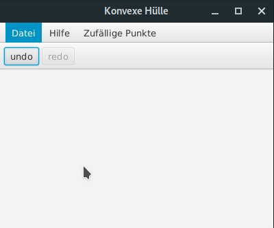

A GUI for the smallest polygon containing a set of points ([Convex Hull][1]) and the biggest circle within it ([Incircle][2])

run with `./gradlew run`

[1]: https://en.wikipedia.org/wiki/Convex_hull
[2]: https://en.wikipedia.org/wiki/Tangential_polygon